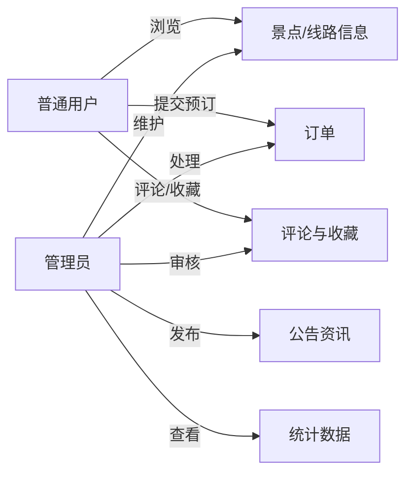
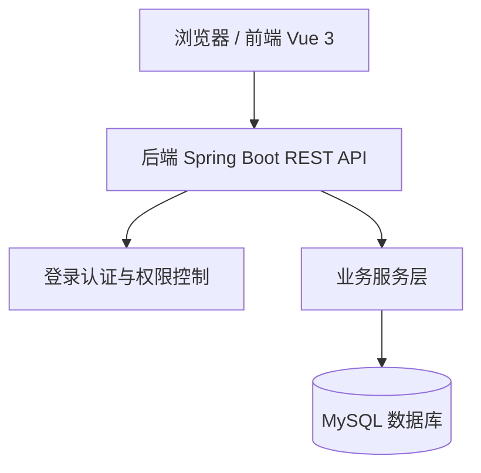

# 旅游管理系统可行性研究报告

> 文档状态：最终收尾版
> 项目名称：旅游管理系统
> 开发方式：4 人左右课程设计小组协作开发
> 适用阶段：立项、选题确认、需求分析前置依据
> 版本：v1.0

## 1. 引言

### 1.1 编写目的

编写本报告的目的是对“旅游管理系统”的开发背景、目标范围、技术条件、经济投入、运行收益和社会因素进行初步分析，判断该系统是否适合作为软件工程课程设计项目，并为后续《需求分析规格说明书》《软件设计规格说明书》和源程序开发提供依据。

本报告重点回答以下问题：

1. 系统是否具有明确的实际应用价值；
2. 系统规模是否适合 4 人左右小组在课程设计周期内完成；
3. 所选技术是否可行、成本是否可控；
4. 是否具备经济、技术、操作和法律方面的可行性。

### 1.2 项目背景

随着旅游信息化的发展，游客在出行前通常需要查询景点、浏览线路、比较价格、提交预订、查看公告和评价内容。传统依赖人工记录或分散表格管理的方式存在信息更新不及时、订单处理效率低、统计困难、评论缺少审核等问题。

本项目拟开发一个面向课程设计场景的小型旅游管理系统，提供用户端与管理员端两类功能：普通用户可以注册登录、查看景点和线路、提交线路预订、取消订单、收藏和评论；管理员可以维护景点、线路、订单、评论和公告，并查看基础统计数据。

本系统不涉及在线支付、第三方地图、真实短信验证、真实旅游供应链对接等复杂业务，避免系统范围过大。

### 1.3 定义

| 术语 | 说明 |
|---|---|
| 普通用户 | 旅游系统的游客用户，可浏览、预订、收藏、评论和维护个人信息。 |
| 管理员 | 系统管理人员，可维护基础数据、处理订单、审核评论、发布公告和查看统计。 |
| 景点 | 旅游目的地信息，包括名称、分类、地址、票价、开放时间、简介和图片。 |
| 旅游线路 | 可被用户预订的旅游产品，包括线路名称、行程安排、价格、出发时间、名额和状态。 |
| 订单 | 用户对旅游线路提交的预订记录，包含预订人数、金额和处理状态。 |
| 评论审核 | 用户提交评论后默认为待审核，管理员审核通过后才在前台展示。 |

### 1.4 参考资料

1. 《软件工程课程设计》指导书；
2. 课程提供的参考范文结构；
3. 《软件工程导论》《数据库系统概论》等课程教材；
4. 本项目组讨论记录和功能范围说明。

## 2. 可行性研究的前提

### 2.1 系统要求

#### 2.1.1 主要功能

系统初版功能限定如下：

| 模块 | 功能说明 | 用户角色 |
|---|---|---|
| 用户管理 | 注册、登录、退出、个人信息维护、密码修改 | 普通用户、管理员 |
| 权限控制 | 区分普通用户与管理员，限制后台功能访问 | 系统 |
| 景点管理 | 景点新增、修改、删除、查询、上下架、图片地址维护 | 管理员 |
| 景点浏览 | 按名称、分类、地址模糊查询景点详情 | 普通用户、游客 |
| 线路管理 | 维护线路名称、行程、价格、出发时间、名额和状态 | 管理员 |
| 线路预订 | 用户选择线路、填写联系人和人数、提交订单 | 普通用户 |
| 订单管理 | 用户查看和取消订单，管理员查看、确认、驳回和完成订单 | 普通用户、管理员 |
| 评论收藏 | 用户收藏景点或线路，提交评论；管理员审核评论 | 普通用户、管理员 |
| 公告资讯 | 管理员发布公告，用户查看公告列表和详情 | 普通用户、管理员 |
| 数据统计 | 统计景点数量、线路数量、订单数量和订单金额 | 管理员 |

#### 2.1.2 主要性能

| 指标 | 初步要求 |
|---|---|
| 查询响应 | 本地开发环境下普通列表查询响应时间不超过 3 秒。 |
| 数据正确性 | 订单金额由系统根据线路单价和人数自动计算。 |
| 安全性 | 密码加密存储；接口按角色鉴权；管理员接口禁止普通用户访问。 |
| 易用性 | 页面结构清晰，核心操作不超过 3 步完成。 |
| 可维护性 | 按前端、后端、数据库和文档分层维护，模块命名统一。 |

#### 2.1.3 范围边界

本项目为课程设计小型系统，明确不纳入初版开发范围：

- 不接入真实在线支付、退款和发票系统；
- 不接入第三方地图、短信、邮件和实名认证服务；
- 不实现复杂推荐算法、分销、优惠券、客服聊天；
- 不实现高并发抢票、分布式部署、微服务架构；
- 图片上传可采用图片 URL 或本地静态资源路径，不强制实现云存储。

### 2.2 系统目标

1. 建立统一的旅游景点、线路和订单信息管理平台；
2. 提高旅游信息维护效率，减少人工统计和重复录入；
3. 为用户提供便捷的线路浏览、预订、收藏和评论功能；
4. 为管理员提供订单处理、评论审核、公告发布和基础统计能力；
5. 形成完整的软件工程课程设计过程文档和可运行软件源程序。

### 2.3 条件、假定和限定

| 项目 | 说明 |
|---|---|
| 开发周期 | 按课程设计周期划分为需求、设计、编码、测试、文档整理阶段。 |
| 开发人员 | 4 人左右小组，按前端、后端、数据库测试、文档项目管理分工。 |
| 硬件条件 | 学生个人电脑或实验室电脑即可。 |
| 软件条件 | JDK 17、Node.js 18+、MySQL 8.0、Git、VS Code / IntelliJ IDEA。 |
| 技术路线 | Spring Boot + Vue 3 + MySQL 的前后端分离单体系统。 |
| 数据规模 | 课程演示数据规模：景点 20 条以内，线路 20 条以内，用户 50 条以内，订单 200 条以内。 |
| 运行环境 | 本地运行或局域网演示，不要求公网部署。 |

### 2.4 决定可行性的主要因素

| 因素 | 判断依据 |
|---|---|
| 技术可行性 | 所用技术均为课程常见 Web 开发技术，资料丰富，功能复杂度可控。 |
| 经济可行性 | 采用开源工具和学生自有设备，主要成本为开发学习时间和少量运行维护成本。 |
| 操作可行性 | 普通用户和管理员操作流程清晰，页面以表单和列表为主，学习成本低。 |
| 法律可行性 | 使用合法开源软件，演示数据为虚构数据，不采集敏感真实身份信息。 |
| 进度可行性 | 系统为单体课程项目，模块可并行开发，初版功能可按优先级取舍。 |

## 3. 对现有业务的分析

### 3.1 现有业务现状

在没有统一旅游管理系统的情况下，旅游信息可能分散在表格、文档、聊天记录或人工登记表中。管理员需要手动维护景点和线路信息，用户通过线下咨询或零散页面了解行程，预订记录也可能依赖人工统计。

### 3.2 存在问题

1. 景点和线路信息分散，更新不及时；
2. 用户无法方便地查看订单状态；
3. 管理员处理订单依赖人工沟通，容易遗漏；
4. 评论内容缺少审核机制，影响信息质量；
5. 统计报表需要人工汇总，效率较低。

### 3.3 业务流程概述

### 3.4 数据流概述

用户端产生注册信息、预订信息、评论信息和收藏信息；管理员端产生景点信息、线路信息、公告信息和审核结果。系统通过数据库集中保存，并向不同角色提供查询和统计结果。

## 4. 所建议的系统

### 4.1 系统方案概述

建议开发基于 Web 的前后端分离旅游管理系统。前端负责页面展示和用户交互，后端提供 REST API，数据库保存用户、景点、线路、订单、评论、收藏和公告等数据。

### 4.2 建议系统的主要特点

1. 功能围绕旅游信息管理和线路预订展开，主题明确；
2. 用户端与管理员端分离，权限边界清晰；
3. 订单状态、线路名额和评论审核采用简单状态机，便于实现；
4. 数据统计以实时查询为主，不额外引入复杂报表系统；
5. 可根据课程时间优先完成核心功能，公告、收藏等可作为增强功能。

### 4.3 技术可行性

本项目采用 Spring Boot、Vue 3 和 MySQL。该技术组合适合实现用户登录、CRUD 管理、订单处理和统计查询等常规 Web 功能。团队成员可以根据课程中已掌握的 Java、数据库和前端基础进行开发，所需工具均可在学生电脑中免费安装。

技术风险及应对：

| 风险 | 应对措施 |
|---|---|
| 前后端接口对接不一致 | 先编写接口文档和统一响应格式，再开发页面。 |
| 数据库字段频繁变动 | 数据库设计评审后再编码，变更必须同步文档。 |
| 登录权限实现复杂 | 初版只设置 USER、ADMIN 两类角色。 |
| 图片上传耗时 | 初版允许使用图片 URL 或静态资源路径。 |

### 4.4 操作可行性

系统使用浏览器访问，普通用户主要操作为注册、登录、浏览、预订、取消、收藏和评论；管理员主要操作为后台列表维护和订单审核。功能均采用常见表单、表格、按钮和弹窗交互，用户经过简单说明即可使用。

### 4.5 法律与社会可行性

系统仅用于课程设计演示，不采集真实敏感身份信息。景点、线路和订单数据可以使用虚构数据或公开可描述的信息。项目使用开源框架时应保留相关许可证说明，不将课程项目用于商业交易。

### 4.6 对开发和运行的影响

| 方面 | 影响 |
|---|---|
| 对设备 | 学生个人电脑即可完成开发，演示时可本地启动。 |
| 对软件 | 需要安装 JDK、Node.js、MySQL、Git 和 IDE。 |
| 对用户 | 管理员需要学习后台数据维护流程。 |
| 对数据 | 需要初始化基础用户、景点、线路和公告数据。 |
| 对文档 | 需求、设计、测试和总结文档应随代码同步更新。 |

## 5. 经济可行性分析

> 说明：本项目为课程设计，以下成本与收益采用“折算估算”方式，用于说明经济可行性分析方法。金额单位为人民币万元，折现率按 5% 估算，系统分析周期按 5 年计算。

### 5.1 投资成本

一次性投资成本包括需求调研、设计编码、测试验收、设备折旧和资料培训等。

| 成本项目 | 估算依据 | 金额（万元） |
|---|---|---:|
| 需求调研与文档编写 | 4 人分工完成可行性、需求、设计初稿 | 0.50 |
| 系统设计与编码 | 前端、后端、数据库、接口开发 | 1.60 |
| 测试与修改 | 单元测试、集成测试、验收测试和缺陷修复 | 0.40 |
| 设备与环境折旧 | 使用个人电脑、实验室网络和本地数据库折算 | 0.20 |
| 培训与资料 | 用户手册、运行指南、演示数据准备 | 0.10 |
| **一次性投资合计** |  | **2.80** |

### 5.2 运行成本

系统采用本地或局域网部署，运行成本较低。假设每年运行维护成本为 0.40 万元，折现率为 5%。

| 年份 | 将来费用（万元） | 折现系数 | 现在费用值（万元） | 累计现在费用值（万元） |
|---:|---:|---:|---:|---:|
| 第 1 年 | 0.40 | 1.0500 | 0.3810 | 0.3810 |
| 第 2 年 | 0.40 | 1.1025 | 0.3628 | 0.7438 |
| 第 3 年 | 0.40 | 1.1576 | 0.3455 | 1.0893 |
| 第 4 年 | 0.40 | 1.2155 | 0.3291 | 1.4184 |
| 第 5 年 | 0.40 | 1.2763 | 0.3134 | 1.7318 |

运行成本现值合计约为 **1.7318 万元**。因此，系统总成本现值为：

> 总成本现值 = 一次性投资 2.80 + 运行成本现值 1.7318 = **4.5318 万元**。

### 5.3 收益分析

系统收益主要体现在减少人工登记、提高订单处理效率、减少信息错误和提升服务体验等方面。假设系统投入使用后，每年可产生折算收益 1.50 万元。

| 收益项目 | 估算说明 | 年收益（万元） |
|---|---|---:|
| 人工处理节约 | 减少线路咨询、订单登记、统计汇总时间 | 0.80 |
| 信息错误减少 | 降低重复登记、订单遗漏、状态不一致造成的损耗 | 0.30 |
| 服务效率提升 | 用户自主查询、预订和查看公告，提高服务能力 | 0.25 |
| 管理分析收益 | 通过统计数据辅助线路和景点维护 | 0.15 |
| **年收益合计** |  | **1.50** |

按 5 年、5% 折现率计算收益现值：

| 年份 | 将来收益（万元） | 折现系数 | 现在收益值（万元） | 累计现在收益值（万元） |
|---:|---:|---:|---:|---:|
| 第 1 年 | 1.50 | 1.0500 | 1.4286 | 1.4286 |
| 第 2 年 | 1.50 | 1.1025 | 1.3605 | 2.7891 |
| 第 3 年 | 1.50 | 1.1576 | 1.2958 | 4.0849 |
| 第 4 年 | 1.50 | 1.2155 | 1.2341 | 5.3190 |
| 第 5 年 | 1.50 | 1.2763 | 1.1753 | 6.4943 |

系统收益现值合计约为 **6.4943 万元**。

### 5.4 成本/收益分析

| 指标 | 结果 |
|---|---:|
| 总成本现值 | 4.5318 万元 |
| 总收益现值 | 6.4943 万元 |
| 纯收益现值 | 1.9625 万元 |
| 成本收益比 | 6.4943 / 4.5318 ≈ 1.43 |
| 投资回收期 | 约 3.36 年 |
| 投资回报率 | 1.9625 / 4.5318 × 100% ≈ 43.3% |

投资回收期估算：第 3 年累计收益现值为 4.0849 万元，距离总成本现值 4.5318 万元还差 0.4469 万元；第 4 年收益现值为 1.2341 万元，因此回收期约为：

> 3 + 0.4469 / 1.2341 ≈ **3.36 年**。

### 5.5 经济可行性结论

系统总收益现值大于总成本现值，成本收益比大于 1，投资回收期在可接受范围内。考虑本项目使用开源工具和课程设计已有环境，实际现金支出更低，因此从经济角度看，开发旅游管理系统是可行的。

## 6. 社会因素可行性分析

### 6.1 法律可行性

系统使用合法开源技术，演示数据为虚构数据或公开可描述信息，不涉及真实支付、真实身份证核验和真实用户隐私交易。开发过程中应注意不复制商业网站的受版权保护图片、文本和界面资源。

### 6.2 用户使用可行性

普通用户和管理员一般具备基本浏览器操作能力。系统功能以列表、详情、表单和按钮为主，经过简单阅读运行指南即可完成操作。

### 6.3 数据安全可行性

初版系统采用密码加密存储、登录令牌、角色鉴权和后台接口访问控制。课程演示环境中建议使用虚构数据，避免录入真实敏感信息。

## 7. 结论

旅游管理系统具有明确的课程设计价值和应用背景，功能范围适中，适合 4 人左右小组分工协作完成。项目在技术、经济、操作、法律和进度方面均具备可行性。建议进入需求分析和软件设计阶段，并在开发过程中严格控制范围，优先完成用户管理、景点管理、线路管理、订单预订和管理员处理等核心功能。
