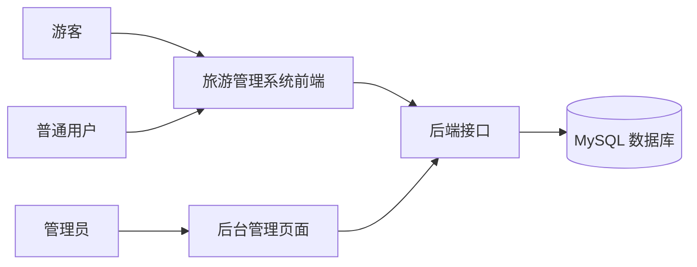
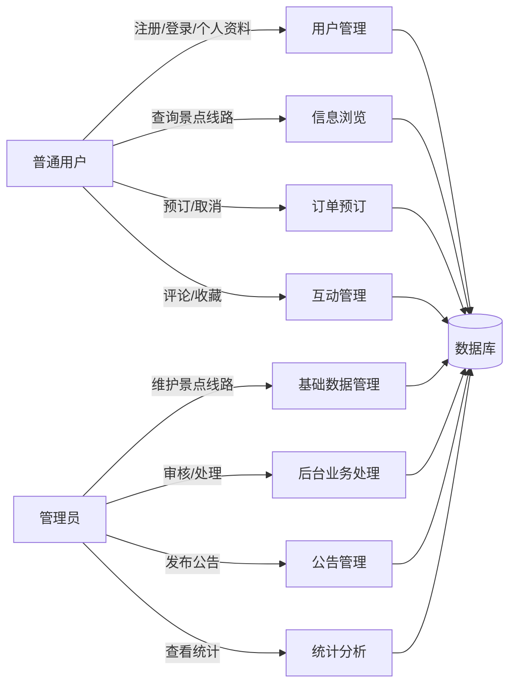

# 旅游管理系统需求分析规格说明书

> 文档状态：初版骨架 + 示例内容  
> 项目名称：旅游管理系统  
> 版本：v0.1  
> 适用阶段：需求评审、设计依据、验收依据

## 1. 引言

### 1.1 编写目的

本文档用于明确旅游管理系统的业务需求、功能需求、数据需求、性能需求和运行环境要求，作为后续软件设计、编码实现、测试验收和项目总结的依据。

### 1.2 项目背景

本系统面向课程设计场景，模拟小型旅游服务平台的核心管理流程。系统提供用户端和管理员端：用户端用于旅游信息查询、线路预订、订单取消、收藏和评论；管理员端用于景点、线路、订单、评论、公告和统计管理。

### 1.3 读者对象

| 读者 | 关注内容 |
|---|---|
| 指导教师 | 系统范围、需求完整性、验收标准。 |
| 项目组成员 | 功能边界、数据结构、接口约束。 |
| 前端开发人员 | 页面、交互、字段校验和权限显示。 |
| 后端开发人员 | 业务规则、接口、数据库实体。 |
| 测试人员 | 测试用例和验收依据。 |

### 1.4 参考资料

1. 《软件工程课程设计》指导书；
2. 课程提供的图书管理系统范文结构；
3. 本项目《可行性研究报告》；
4. 项目组功能范围讨论记录。

## 2. 任务概述

### 2.1 系统目标

旅游管理系统的目标包括：

1. 为游客提供景点、旅游线路、公告资讯的浏览入口；
2. 支持注册用户预订线路、取消订单、收藏景点或线路、提交评论；
3. 支持管理员维护景点、线路、订单、评论和公告数据；
4. 支持基础统计，展示景点数量、线路数量、订单数量和订单金额；
5. 输出符合课程设计要求的完整文档和可运行源程序。

### 2.2 用户特点

| 用户类型 | 特点 | 使用频率 | 典型操作 |
|---|---|---|---|
| 游客 | 未登录访问者，只能浏览公开信息 | 低到中 | 查看景点、线路、公告 |
| 普通用户 | 已注册用户，具备预订和互动能力 | 中 | 预订线路、取消订单、收藏、评论 |
| 管理员 | 系统后台管理人员 | 中到高 | 管理数据、处理订单、审核评论、发布公告 |
| 维护人员 | 开发小组或部署人员 | 低 | 初始化数据库、运行系统、排查问题 |

### 2.3 业务范围

系统聚焦旅游信息展示和线路预订管理，核心对象包括用户、景点、线路、订单、评论、收藏和公告。系统不处理真实支付和真实出行履约，仅模拟订单状态流转。

### 2.4 系统上下文

## 3. 需求规定

### 3.1 功能需求总览

| 编号 | 模块 | 需求名称 | 优先级 |
|---|---|---|---|
| FR-01 | 用户管理 | 用户注册、登录、退出、个人信息维护 | 必须 |
| FR-02 | 权限控制 | 普通用户和管理员权限区分 | 必须 |
| FR-03 | 景点信息 | 景点增删改查、浏览和详情展示 | 必须 |
| FR-04 | 旅游线路 | 线路增删改查、浏览和详情展示 | 必须 |
| FR-05 | 订单预订 | 用户预订线路、查看订单、取消订单 | 必须 |
| FR-06 | 订单处理 | 管理员查看、确认、驳回、完成订单 | 必须 |
| FR-07 | 评论管理 | 用户评论、管理员审核、前台展示通过评论 | 应该 |
| FR-08 | 收藏管理 | 用户收藏景点或线路、取消收藏 | 应该 |
| FR-09 | 公告资讯 | 管理员发布公告，用户查看公告 | 应该 |
| FR-10 | 数据统计 | 景点、线路、订单数量和金额统计 | 应该 |

### 3.2 用户管理需求

#### FR-01-01 用户注册

- 用户输入用户名、密码、确认密码、手机号或邮箱；
- 用户名必须唯一；
- 密码不能为空，建议长度不少于 6 位；
- 注册成功后角色默认为普通用户；
- 注册失败时应返回明确错误提示。

#### FR-01-02 用户登录

- 用户输入用户名和密码；
- 系统验证账号状态和密码；
- 登录成功后返回用户基本信息和访问令牌；
- 管理员登录后可以访问后台管理页面；
- 普通用户访问管理员接口时应被拒绝。

#### FR-01-03 个人信息管理

- 普通用户可以查看和修改昵称、手机号、邮箱、头像地址等信息；
- 用户不能修改自己的角色；
- 管理员可以禁用或启用用户账号，初版可不提供复杂角色分配功能。

### 3.3 景点信息需求

#### FR-03-01 景点字段

景点信息至少包括：景点名称、分类、地址、票价、开放时间、简介、图片、状态、创建时间和更新时间。

#### FR-03-02 管理员维护景点

- 管理员可以新增、修改、删除和查询景点；
- 景点名称不能为空；
- 票价不能为负数；
- 删除景点前，应提示确认；
- 对已被收藏或评论的景点，建议采用“下架”而非物理删除。

#### FR-03-03 用户浏览景点

- 游客和普通用户可以查看已上架景点列表；
- 支持按名称、分类、地址进行查询；
- 景点详情展示简介、图片、开放时间、票价、评论和收藏入口。

### 3.4 旅游线路需求

#### FR-04-01 线路字段

线路信息至少包括：线路名称、行程安排、价格、出发时间、名额、已预订人数、线路状态、封面图片和简介。

#### FR-04-02 管理员维护线路

- 管理员可以新增、修改、删除和查询线路；
- 线路价格不能为负数；
- 线路名额必须为正整数；
- 线路状态包括：草稿、开放预订、名额已满、已关闭；
- 已有有效订单的线路不建议物理删除，可改为关闭状态。

#### FR-04-03 用户浏览线路

- 用户可查看开放或可展示状态的线路；
- 支持按线路名称、出发时间和线路状态查询；
- 线路详情展示行程安排、价格、出发时间、剩余名额和预订入口。

### 3.5 订单预订需求

#### FR-05-01 用户预订线路

- 用户必须登录后才能预订；
- 用户选择线路、填写联系人姓名、联系电话和预订人数；
- 系统检查线路状态是否开放、剩余名额是否充足；
- 系统自动计算订单金额：`订单金额 = 线路价格 × 预订人数`；
- 提交成功后订单状态为“待处理”；
- 系统锁定相应名额，取消或驳回时释放名额。

#### FR-05-02 用户查看订单

- 用户只能查看自己的订单；
- 订单列表展示订单编号、线路名称、人数、金额、状态、创建时间；
- 订单详情展示联系人信息、线路信息和处理备注。

#### FR-05-03 用户取消订单

- 用户可取消“待处理”或“已确认但未出发”的订单；
- 已完成、已取消、已驳回订单不能重复取消；
- 取消成功后释放线路名额。

### 3.6 管理员订单处理需求

#### FR-06-01 查看订单

管理员可以按订单编号、用户、线路、状态、时间范围查询订单。

#### FR-06-02 处理订单

管理员可以对订单执行以下操作：

| 当前状态 | 可执行操作 | 结果状态 |
|---|---|---|
| 待处理 | 确认 | 已确认 |
| 待处理 | 驳回 | 已驳回，并释放名额 |
| 已确认 | 完成 | 已完成 |
| 待处理/已确认 | 管理员取消 | 已取消，并释放名额 |

### 3.7 评论与收藏需求

#### FR-07 评论管理

- 用户登录后可对景点或线路发表评论；
- 评论字段包括目标类型、目标编号、评分、评论内容、审核状态；
- 评论默认状态为“待审核”；
- 管理员审核通过后，评论才在用户端展示；
- 管理员可驳回不合适评论，并填写审核备注。

#### FR-08 收藏管理

- 用户可收藏景点或线路；
- 同一用户对同一目标只能收藏一次；
- 用户可以查看收藏列表并取消收藏。

### 3.8 公告资讯需求

- 管理员可以新增、修改、删除、发布和下架公告；
- 公告字段包括标题、内容、状态、发布时间；
- 用户可查看已发布公告列表和详情。

### 3.9 数据统计需求

管理员可以查看以下统计指标：

1. 景点总数；
2. 线路总数；
3. 订单总数；
4. 不同状态订单数量；
5. 已确认或已完成订单金额合计；
6. 可选：按日期统计订单金额。

### 3.10 数据描述

| 实体 | 主要字段 | 说明 |
|---|---|---|
| 用户 | id、用户名、密码、角色、状态、手机号、邮箱 | 保存登录和个人资料。 |
| 景点 | id、名称、分类、地址、票价、开放时间、简介、图片、状态 | 保存旅游景点基础信息。 |
| 线路 | id、名称、行程、价格、出发时间、名额、已预订、状态 | 保存旅游线路产品信息。 |
| 订单 | id、订单编号、用户、线路、人数、金额、状态、联系人 | 保存线路预订记录。 |
| 评论 | id、用户、目标类型、目标编号、评分、内容、审核状态 | 保存用户评论和审核结果。 |
| 收藏 | id、用户、目标类型、目标编号 | 保存用户收藏关系。 |
| 公告 | id、标题、内容、状态、发布时间 | 保存旅游公告资讯。 |

### 3.11 数据流图

## 4. 非功能需求

### 4.1 性能需求

| 指标 | 要求 |
|---|---|
| 登录响应 | 本地环境下不超过 3 秒。 |
| 列表查询 | 常规分页查询不超过 3 秒。 |
| 统计查询 | 数据量在课程演示范围内不超过 5 秒。 |
| 并发要求 | 支持小组演示和教师验收场景，不要求高并发压测。 |

### 4.2 安全需求

1. 密码必须加密存储，不得明文保存；
2. 管理员接口必须进行角色校验；
3. 普通用户只能操作自己的订单、评论和收藏；
4. 表单输入需要进行基本合法性校验；
5. 错误信息不应暴露数据库密码、SQL 语句等敏感内容。

### 4.3 可用性需求

1. 页面名称和按钮含义清晰；
2. 新增、修改、删除操作有成功或失败提示；
3. 重要删除操作需要二次确认；
4. 表单校验错误应提示具体字段。

### 4.4 可维护性需求

1. 前后端目录结构清晰；
2. 接口统一以 `/api` 开头；
3. 业务状态使用枚举或固定常量；
4. 数据库字段命名统一采用下划线风格；
5. 每次修改核心业务逻辑后同步更新相关开发文档。

## 5. 运行环境规定

### 5.1 硬件环境

| 角色 | 建议配置 |
|---|---|
| 开发机 | CPU 双核及以上，内存 8GB 及以上，硬盘剩余空间 10GB 以上。 |
| 演示机 | 可运行浏览器、JDK、Node.js 和 MySQL。 |

### 5.2 软件环境

| 软件 | 版本建议 |
|---|---|
| 操作系统 | Windows 10/11、macOS 或 Linux 均可。 |
| JDK | 17 或以上。 |
| Node.js | 18 或以上。 |
| MySQL | 8.0 或以上。 |
| 后端框架 | Spring Boot 3.x。 |
| 前端框架 | Vue 3 + Vite。 |
| 项目管理 | Git。 |

## 6. 验收标准

1. 能够正常启动前端、后端和数据库；
2. 普通用户可以完成注册、登录、浏览、预订、取消、收藏、评论；
3. 管理员可以完成景点、线路、订单、评论、公告和统计管理；
4. 权限控制有效，普通用户不能访问后台管理接口；
5. 订单金额和线路名额变化正确；
6. 文档与源代码保持一致；
7. 提供源程序说明与运行指南，教师可按指南运行系统。
