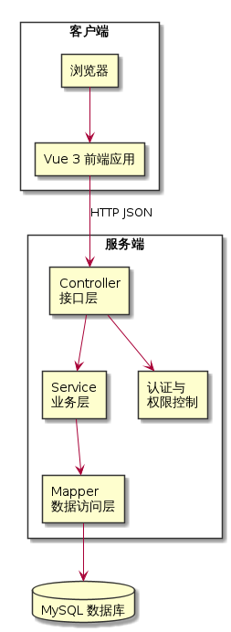
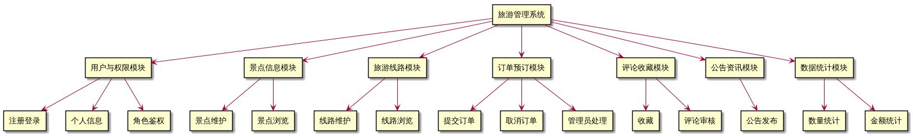
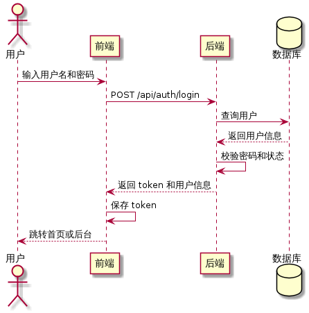
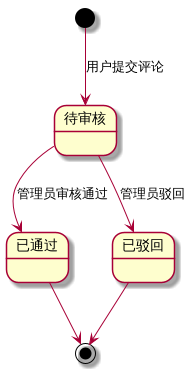
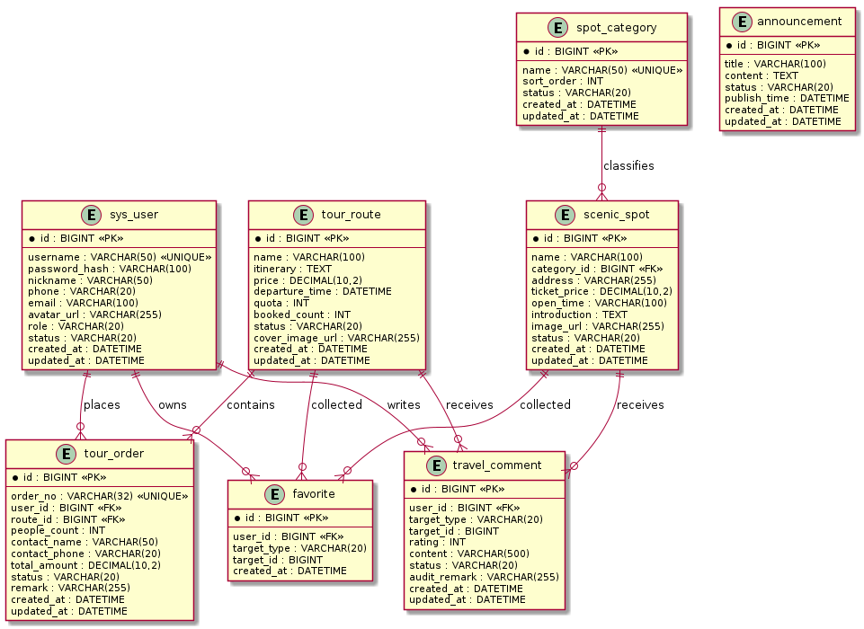

# 旅游管理系统软件设计规格说明书

> 文档状态：最终收尾版
> 项目名称：旅游管理系统
> 版本：v1.0
> 适用阶段：概要设计、详细设计、编码依据

## 1. 引言

### 1.1 编写目的

本文档根据《旅游管理系统需求分析规格说明书》对系统进行概要设计和详细设计，描述系统架构、模块划分、数据库结构、接口设计、界面设计和安全设计，为编码实现、测试和维护提供依据。

### 1.2 项目背景

旅游管理系统是面向课程设计的小型 Web 应用，用于实现旅游景点信息管理、旅游线路管理、订单预订处理、评论收藏、公告资讯和基础统计等功能。系统分为用户端和管理员端，采用前后端分离方式开发。

### 1.3 设计原则

1. 功能范围适中，优先保证核心业务闭环；
2. 分层清晰，前端、后端、数据库职责明确；
3. 数据一致性优先，订单状态和线路名额必须正确；
4. 权限边界清晰，管理员功能和用户功能分离；
5. 文档与代码同步维护，便于课程验收。

## 2. 需求概述

系统核心需求如下：

1. 用户注册、登录和个人信息管理；
2. 管理员登录与后台权限控制；
3. 景点信息增删改查和前台展示；
4. 旅游线路增删改查、状态管理和前台展示；
5. 用户提交线路订单、查看订单和取消订单；
6. 管理员查看并处理订单；
7. 用户提交评论和收藏，管理员审核评论；
8. 管理员发布公告，用户查看公告；
9. 管理员查看统计数据。

## 3. 总体设计

### 3.1 系统架构

本系统采用浏览器/服务器架构和前后端分离开发模式。



*图 3-1 系统总体架构图*

### 3.2 技术架构

| 层次 | 技术 | 说明 |
|---|---|---|
| 前端 | Vue 3、Vite、Element Plus、Axios、Pinia | 页面展示、路由、状态管理、接口调用。 |
| 后端 | Spring Boot 3、Spring Security/JWT、MyBatis-Plus | REST API、鉴权、业务处理、数据库访问。 |
| 数据库 | MySQL 8.0 | 保存用户、景点、线路、订单等数据。 |
| 构建工具 | Maven、npm | 后端和前端依赖管理。 |
| 文档 | Markdown | 课程交付和开发指导文档。 |

### 3.3 功能模块结构



*图 3-2 功能模块结构图*

### 3.4 目录结构设计

建议源程序目录如下：

```text
tourism-management-system/
├── backend/                     # Spring Boot 后端
│   ├── src/main/java/com/tourism/
│   │   ├── controller/          # REST 控制器
│   │   ├── service/             # 业务逻辑层
│   │   ├── mapper/              # MyBatis-Plus Mapper 接口
│   │   ├── entity/              # 数据库实体类
│   │   ├── dto/                 # 请求/响应 DTO
│   │   ├── config/              # Spring Security、JWT、CORS 等配置
│   │   └── common/              # 统一响应格式、常量、异常处理
│   └── src/main/resources/
│       └── application.yml      # 后端配置文件
├── frontend/                    # Vue 3 前端
│   ├── src/api/                 # Axios 请求模块
│   ├── src/router/              # Vue Router（含路由守卫）
│   ├── src/stores/              # Pinia 状态管理
│   ├── src/views/               # 页面组件
│   ├── src/components/          # 公共组件
│   └── src/utils/               # Axios 实例、工具函数
├── database/
│   ├── schema.sql               # DDL（8 张表）
│   └── data.sql                 # 初始化数据
├── docs/
│   ├── deliverables/            # 课程最终交付文档
│   └── dev/                     # 开发指导文档
├── CLAUDE.md
└── README.md
```

## 4. 详细设计

### 4.1 用户与权限模块

#### 4.1.1 模块职责

- 用户注册；
- 用户登录；
- 登录令牌生成与校验；
- 获取当前登录用户信息；
- 修改个人信息；
- 管理员接口角色校验。

#### 4.1.2 主要类设计

| 类/文件 | 职责 |
|---|---|
| `AuthController` | 注册、登录、退出、获取当前用户。 |
| `UserController` | 用户个人信息维护、管理员用户查询。 |
| `UserService` | 用户业务逻辑，密码加密和账号状态校验。 |
| `JwtTokenUtil` | 生成和解析登录令牌。 |
| `LoginUser` | 登录用户上下文对象。 |

#### 4.1.3 登录流程



*图 4-1 登录时序图*

### 4.2 景点信息模块

#### 4.2.1 模块职责

- 管理员维护景点信息；
- 用户查询景点列表和详情；
- 支持分类、名称、地址查询；
- 控制景点上架和下架状态。

#### 4.2.2 景点状态

| 状态 | 说明 |
|---|---|
| ON | 上架，可在前台展示。 |
| OFF | 下架，仅管理员可见。 |

#### 4.2.3 景点保存校验

```text
IF 景点名称为空 THEN 返回“景点名称不能为空”
IF 票价 < 0 THEN 返回“票价不能小于 0”
IF 状态为空 THEN 默认设置为 ON
保存景点信息
```

### 4.3 旅游线路模块

#### 4.3.1 模块职责

- 管理员维护线路信息；
- 用户浏览线路列表和详情；
- 维护线路名额、已预订人数和状态；
- 提供订单预订时的线路可订性校验。

#### 4.3.2 线路状态

| 状态 | 说明 | 是否允许预订 |
|---|---|---|
| DRAFT | 草稿 | 否 |
| OPEN | 开放预订 | 是 |
| FULL | 名额已满 | 否 |
| CLOSED | 已关闭 | 否 |

### 4.4 订单预订模块

#### 4.4.1 模块职责

- 用户提交预订；
- 用户查看订单和取消订单；
- 管理员确认、驳回、完成、取消订单；
- 维护线路名额和订单金额一致性。

#### 4.4.2 订单状态

| 状态 | 说明 |
|---|---|
| PENDING | 待处理，用户已提交，等待管理员处理。 |
| CONFIRMED | 已确认，管理员确认订单。 |
| CANCELLED | 已取消，用户或管理员取消。 |
| REJECTED | 已驳回，管理员拒绝订单。 |
| COMPLETED | 已完成，出行或服务完成。 |

#### 4.4.3 预订流程伪代码

```text
输入：用户ID、线路ID、预订人数、联系人、联系电话
1. 校验用户是否登录
2. 查询线路信息
3. IF 线路不存在 THEN 返回错误
4. IF 线路状态 != OPEN THEN 返回“线路不可预订”
5. IF 预订人数 <= 0 THEN 返回“预订人数必须大于0”
6. IF 线路名额 - 已预订人数 < 预订人数 THEN 返回“剩余名额不足”
7. 订单金额 = 线路价格 * 预订人数
8. 创建订单，状态为 PENDING
9. 增加线路已预订人数
10. IF 已预订人数 >= 名额 THEN 设置线路状态为 FULL
11. 返回订单编号
```

#### 4.4.4 取消订单流程伪代码

```text
输入：订单ID、当前用户
1. 查询订单
2. 校验订单属于当前用户或当前用户为管理员
3. IF 订单状态不在 PENDING/CONFIRMED THEN 返回“当前状态不可取消”
4. 修改订单状态为 CANCELLED
5. 释放线路已预订人数
6. IF 线路状态为 FULL 且剩余名额大于0 THEN 设置为 OPEN
7. 返回取消成功
```

### 4.5 评论与收藏模块

#### 4.5.1 评论审核流程



*图 4-2 评论审核状态图*

#### 4.5.2 收藏规则

- 收藏目标类型为 `SPOT` 或 `ROUTE`；
- 同一用户对同一目标只能收藏一次；
- 取消收藏时仅删除当前用户自己的收藏记录。

### 4.6 公告资讯模块

管理员维护公告，用户端只展示已发布公告。公告状态包括 `DRAFT`、`PUBLISHED`、`OFFLINE`。公告发布时间可在发布时自动生成。

### 4.7 数据统计模块

统计模块不单独保存统计表，而是根据业务表实时查询。统计字段包括：

- 景点数量：`scenic_spot` 表记录数；
- 线路数量：`tour_route` 表记录数；
- 订单数量：`tour_order` 表记录数；
- 订单金额：状态为 `CONFIRMED` 或 `COMPLETED` 的订单金额合计。

## 5. 数据库设计

### 5.1 E-R 图



*图 5-1 E-R 图*

### 5.2 主要数据表

#### 5.2.1 用户表 `sys_user`

| 字段 | 类型 | 约束 | 说明 |
|---|---|---|---|
| id | BIGINT | PK | 用户编号。 |
| username | VARCHAR(50) | UNIQUE, NOT NULL | 登录用户名。 |
| password_hash | VARCHAR(100) | NOT NULL | 加密密码。 |
| nickname | VARCHAR(50) |  | 昵称。 |
| phone | VARCHAR(20) |  | 手机号。 |
| email | VARCHAR(100) |  | 邮箱。 |
| avatar_url | VARCHAR(255) |  | 头像地址。 |
| role | VARCHAR(20) | NOT NULL | USER 或 ADMIN。 |
| status | VARCHAR(20) | NOT NULL | ENABLED 或 DISABLED。 |
| created_at | DATETIME | NOT NULL | 创建时间。 |
| updated_at | DATETIME | NOT NULL | 更新时间。 |

#### 5.2.2 景点分类表 `spot_category`

| 字段 | 类型 | 约束 | 说明 |
|---|---|---|---|
| id | BIGINT | PK | 分类编号。 |
| name | VARCHAR(50) | UNIQUE, NOT NULL | 分类名称。 |
| sort_order | INT | NOT NULL | 排序序号。 |
| status | VARCHAR(20) | NOT NULL | ON 或 OFF。 |
| created_at | DATETIME | NOT NULL | 创建时间。 |
| updated_at | DATETIME | NOT NULL | 更新时间。 |

#### 5.2.3 景点表 `scenic_spot`

| 字段 | 类型 | 约束 | 说明 |
|---|---|---|---|
| id | BIGINT | PK | 景点编号。 |
| name | VARCHAR(100) | NOT NULL | 景点名称。 |
| category_id | BIGINT | FK | 分类编号，关联 spot_category。 |
| address | VARCHAR(255) |  | 地址。 |
| ticket_price | DECIMAL(10,2) | NOT NULL | 门票价格。 |
| open_time | VARCHAR(100) |  | 开放时间。 |
| introduction | TEXT |  | 简介。 |
| image_url | VARCHAR(255) |  | 图片地址。 |
| status | VARCHAR(20) | NOT NULL | ON 或 OFF。 |
| created_at | DATETIME | NOT NULL | 创建时间。 |
| updated_at | DATETIME | NOT NULL | 更新时间。 |

#### 5.2.4 线路表 `tour_route`

| 字段 | 类型 | 约束 | 说明 |
|---|---|---|---|
| id | BIGINT | PK | 线路编号。 |
| name | VARCHAR(100) | NOT NULL | 线路名称。 |
| itinerary | TEXT | NOT NULL | 行程安排。 |
| price | DECIMAL(10,2) | NOT NULL | 价格。 |
| departure_time | DATETIME | NOT NULL | 出发时间。 |
| quota | INT | NOT NULL | 总名额。 |
| booked_count | INT | NOT NULL | 已预订人数。 |
| status | VARCHAR(20) | NOT NULL | DRAFT/OPEN/FULL/CLOSED。 |
| cover_image_url | VARCHAR(255) |  | 封面图。 |
| created_at | DATETIME | NOT NULL | 创建时间。 |
| updated_at | DATETIME | NOT NULL | 更新时间。 |

#### 5.2.5 订单表 `tour_order`

| 字段 | 类型 | 约束 | 说明 |
|---|---|---|---|
| id | BIGINT | PK | 订单编号。 |
| order_no | VARCHAR(32) | UNIQUE, NOT NULL | 订单号。 |
| user_id | BIGINT | FK, NOT NULL | 用户编号。 |
| route_id | BIGINT | FK, NOT NULL | 线路编号。 |
| people_count | INT | NOT NULL | 预订人数。 |
| contact_name | VARCHAR(50) | NOT NULL | 联系人。 |
| contact_phone | VARCHAR(20) | NOT NULL | 联系电话。 |
| total_amount | DECIMAL(10,2) | NOT NULL | 订单金额。 |
| status | VARCHAR(20) | NOT NULL | PENDING/CONFIRMED/CANCELLED/REJECTED/COMPLETED。 |
| remark | VARCHAR(255) |  | 管理员备注。 |
| created_at | DATETIME | NOT NULL | 创建时间。 |
| updated_at | DATETIME | NOT NULL | 更新时间。 |

#### 5.2.6 评论表 `travel_comment`

| 字段 | 类型 | 约束 | 说明 |
|---|---|---|---|
| id | BIGINT | PK | 评论编号。 |
| user_id | BIGINT | FK, NOT NULL | 评论用户。 |
| target_type | VARCHAR(20) | NOT NULL | SPOT 或 ROUTE。 |
| target_id | BIGINT | NOT NULL | 目标编号。 |
| rating | INT | NOT NULL | 评分，1-5。 |
| content | VARCHAR(500) | NOT NULL | 评论内容。 |
| status | VARCHAR(20) | NOT NULL | PENDING/APPROVED/REJECTED。 |
| audit_remark | VARCHAR(255) |  | 审核备注。 |
| created_at | DATETIME | NOT NULL | 创建时间。 |
| updated_at | DATETIME | NOT NULL | 更新时间。 |

#### 5.2.7 收藏表 `favorite`

| 字段 | 类型 | 约束 | 说明 |
|---|---|---|---|
| id | BIGINT | PK | 收藏编号。 |
| user_id | BIGINT | FK, NOT NULL | 收藏用户。 |
| target_type | VARCHAR(20) | NOT NULL | SPOT 或 ROUTE。 |
| target_id | BIGINT | NOT NULL | 目标编号。 |
| created_at | DATETIME | NOT NULL | 创建时间。 |

#### 5.2.8 公告表 `announcement`

| 字段 | 类型 | 约束 | 说明 |
|---|---|---|---|
| id | BIGINT | PK | 公告编号。 |
| title | VARCHAR(100) | NOT NULL | 公告标题。 |
| content | TEXT | NOT NULL | 公告内容。 |
| status | VARCHAR(20) | NOT NULL | DRAFT/PUBLISHED/OFFLINE。 |
| publish_time | DATETIME |  | 发布时间。 |
| created_at | DATETIME | NOT NULL | 创建时间。 |
| updated_at | DATETIME | NOT NULL | 更新时间。 |

### 5.3 约束和索引

| 表 | 索引/约束 | 说明 |
|---|---|---|
| sys_user | uk_sys_user_username | 用户名唯一。 |
| spot_category | uk_spot_category_name | 分类名称唯一。 |
| scenic_spot | idx_scenic_spot_name | 支持景点名称查询。 |
| scenic_spot | idx_scenic_spot_category | 支持按分类查询。 |
| scenic_spot | fk_spot_category | 外键关联 spot_category。 |
| tour_route | idx_tour_route_name | 支持线路名称查询。 |
| tour_route | idx_tour_route_status | 支持按状态查询。 |
| tour_order | uk_tour_order_no | 订单号唯一。 |
| tour_order | idx_tour_order_user | 支持用户订单查询。 |
| tour_order | idx_tour_order_route | 支持线路订单查询。 |
| tour_order | idx_tour_order_status | 支持按状态查询。 |
| tour_order | fk_order_user | 外键关联 sys_user。 |
| tour_order | fk_order_route | 外键关联 tour_route。 |
| travel_comment | idx_comment_user | 支持用户评论查询。 |
| travel_comment | idx_comment_target | 支持按目标类型和编号查询。 |
| travel_comment | idx_comment_status | 支持按审核状态查询。 |
| travel_comment | fk_comment_user | 外键关联 sys_user。 |
| favorite | uk_favorite_user_target | 用户+目标类型+目标编号唯一，防止重复收藏。 |
| favorite | idx_favorite_user | 支持用户收藏查询。 |
| favorite | fk_favorite_user | 外键关联 sys_user。 |
| announcement | idx_announcement_status | 支持按状态查询。 |

## 6. 接口设计

### 6.1 通用响应格式

```json
{
  "code": 0,
  "message": "success",
  "data": {}
}
```

### 6.2 接口列表

#### 6.2.1 认证接口

| 方法 | 路径 | 权限 | 说明 |
|---|---|---|---|
| POST | `/api/auth/register` | 公开 | 用户注册。 |
| POST | `/api/auth/login` | 公开 | 用户登录。 |
| GET | `/api/auth/me` | USER/ADMIN | 获取当前登录用户信息。 |

#### 6.2.2 分类接口

| 方法 | 路径 | 权限 | 说明 |
|---|---|---|---|
| GET | `/api/categories` | 公开 | 查询所有启用分类。 |
| GET | `/api/admin/categories` | ADMIN | 查询所有分类（含禁用）。 |
| POST | `/api/admin/categories` | ADMIN | 新增分类。 |
| PUT | `/api/admin/categories/{id}` | ADMIN | 修改分类。 |
| DELETE | `/api/admin/categories/{id}` | ADMIN | 删除分类。 |

#### 6.2.3 景点接口

| 方法 | 路径 | 权限 | 说明 |
|---|---|---|---|
| GET | `/api/spots` | 公开 | 景点分页列表（支持 keyword、categoryId 筛选）。 |
| GET | `/api/spots/{id}` | 公开 | 景点详情。 |
| GET | `/api/admin/spots` | ADMIN | 管理员景点列表（支持 keyword、categoryId、status 筛选）。 |
| POST | `/api/admin/spots` | ADMIN | 新增景点。 |
| PUT | `/api/admin/spots/{id}` | ADMIN | 修改景点。 |
| DELETE | `/api/admin/spots/{id}` | ADMIN | 删除景点。 |
| PUT | `/api/admin/spots/{id}/status` | ADMIN | 修改景点状态。 |

#### 6.2.4 线路接口

| 方法 | 路径 | 权限 | 说明 |
|---|---|---|---|
| GET | `/api/routes` | 公开 | 线路分页列表（支持 keyword、status 筛选，仅返回 OPEN/FULL）。 |
| GET | `/api/routes/{id}` | 公开 | 线路详情（仅 OPEN/FULL 可访问）。 |
| GET | `/api/admin/routes` | ADMIN | 管理员线路列表（支持 keyword、status 筛选，含全部状态）。 |
| GET | `/api/admin/routes/{id}` | ADMIN | 管理员线路详情。 |
| POST | `/api/admin/routes` | ADMIN | 新增线路。 |
| PUT | `/api/admin/routes/{id}` | ADMIN | 修改线路。 |
| DELETE | `/api/admin/routes/{id}` | ADMIN | 删除线路。 |
| PUT | `/api/admin/routes/{id}/status` | ADMIN | 修改线路状态。 |

#### 6.2.5 订单接口

| 方法 | 路径 | 权限 | 说明 |
|---|---|---|---|
| POST | `/api/orders` | USER | 创建订单。 |
| GET | `/api/orders/my` | USER | 我的订单列表（支持 status 筛选）。 |
| GET | `/api/orders/{id}` | USER | 订单详情。 |
| PUT | `/api/orders/{id}/cancel` | USER | 用户取消订单。 |
| GET | `/api/admin/orders` | ADMIN | 管理员订单列表（支持 keyword、status 筛选）。 |
| GET | `/api/admin/orders/{id}` | ADMIN | 管理员订单详情。 |
| PUT | `/api/admin/orders/{id}/confirm` | ADMIN | 确认订单。 |
| PUT | `/api/admin/orders/{id}/reject` | ADMIN | 驳回订单。 |
| PUT | `/api/admin/orders/{id}/complete` | ADMIN | 完成订单。 |
| PUT | `/api/admin/orders/{id}/cancel` | ADMIN | 管理员取消订单。 |

#### 6.2.6 评论接口

| 方法 | 路径 | 权限 | 说明 |
|---|---|---|---|
| POST | `/api/comments` | USER | 提交评论（默认 PENDING）。 |
| GET | `/api/comments` | 公开 | 查询已通过评论（按 targetType 和 targetId）。 |
| GET | `/api/admin/comments` | ADMIN | 管理员评论列表（支持 targetType、targetId、status 筛选）。 |
| PUT | `/api/admin/comments/{id}/audit` | ADMIN | 审核评论（APPROVED/REJECTED）。 |

#### 6.2.7 收藏接口

| 方法 | 路径 | 权限 | 说明 |
|---|---|---|---|
| POST | `/api/favorites` | USER | 添加收藏。 |
| GET | `/api/favorites/my` | USER | 我的收藏列表（支持 targetType 筛选）。 |
| DELETE | `/api/favorites/{id}` | USER | 取消收藏。 |

#### 6.2.8 公告接口

| 方法 | 路径 | 权限 | 说明 |
|---|---|---|---|
| GET | `/api/announcements` | 公开 | 已发布公告列表。 |
| GET | `/api/announcements/{id}` | 公开 | 已发布公告详情。 |
| GET | `/api/admin/announcements` | ADMIN | 管理员公告列表（支持 keyword、status 筛选）。 |
| GET | `/api/admin/announcements/{id}` | ADMIN | 管理员公告详情。 |
| POST | `/api/admin/announcements` | ADMIN | 新增公告。 |
| PUT | `/api/admin/announcements/{id}` | ADMIN | 修改公告。 |
| PUT | `/api/admin/announcements/{id}/publish` | ADMIN | 发布公告。 |
| PUT | `/api/admin/announcements/{id}/offline` | ADMIN | 下架公告。 |
| DELETE | `/api/admin/announcements/{id}` | ADMIN | 删除公告。 |

#### 6.2.9 统计接口

| 方法 | 路径 | 权限 | 说明 |
|---|---|---|---|
| GET | `/api/admin/statistics/summary` | ADMIN | 统计汇总（景点数量、线路数量、用户数量、订单数量、订单金额等）。 |

## 7. 界面设计

### 7.1 前台页面

| 页面 | 路由 | 主要内容 |
|---|---|---|
| 首页 | `/` | 推荐景点、推荐线路、公告入口。 |
| 登录注册 | `/login`、`/register` | 用户认证表单。 |
| 景点列表 | `/spots` | 景点查询、分类筛选。 |
| 景点详情 | `/spots/:id` | 景点信息、评论、收藏。 |
| 线路列表 | `/routes` | 线路查询、状态展示。 |
| 线路详情 | `/routes/:id` | 行程、价格、名额、预订按钮。 |
| 我的订单 | `/my/orders` | 订单列表、取消订单。 |
| 我的收藏 | `/my/favorites` | 收藏列表、取消收藏。 |
| 个人中心 | `/profile` | 个人信息维护。 |

### 7.2 后台页面

| 页面 | 路由 | 主要内容 |
|---|---|---|
| 后台首页 | `/admin/dashboard` | 统计卡片。 |
| 景点管理 | `/admin/spots` | 景点列表、新增、编辑、删除。 |
| 线路管理 | `/admin/routes` | 线路列表、新增、编辑、状态维护。 |
| 订单管理 | `/admin/orders` | 订单查询、确认、驳回、完成。 |
| 评论审核 | `/admin/comments` | 评论列表、审核通过、驳回。 |
| 公告管理 | `/admin/announcements` | 公告发布、修改、下架。 |

### 7.3 预订页面交互

1. 用户进入线路详情页；
2. 点击“立即预订”；
3. 系统检查是否登录，未登录则跳转登录页；
4. 用户填写人数、联系人和电话；
5. 前端实时显示预计金额；
6. 提交订单；
7. 成功后跳转“我的订单”。

## 8. 安全保密设计

1. 密码使用 BCrypt 或同等级算法加密；
2. 登录后通过 JWT 或 Session 识别用户；
3. 后端以注解或拦截器限制管理员接口；
4. 普通用户只能访问自己的订单、收藏和评论；
5. 前端隐藏无权限入口，但最终以服务端校验为准；
6. 数据库配置不提交真实生产密码。

## 9. 异常处理设计

| 错误场景 | 处理方式 |
|---|---|
| 登录失败 | 返回用户名或密码错误，不暴露具体密码信息。 |
| 权限不足 | 返回 403 或业务错误码。 |
| 数据不存在 | 返回“记录不存在”。 |
| 名额不足 | 阻止创建订单，提示剩余名额不足。 |
| 重复收藏 | 返回“已收藏，无需重复操作”。 |
| 表单校验失败 | 返回具体字段错误提示。 |

## 10. 系统维护和改进

初版完成后可根据时间增加以下改进：

1. 图片上传到本地服务器；
2. 订单按日期图表统计；
3. 管理员操作日志；
4. 线路关联多个景点；
5. 导出订单报表。

以上功能属于扩展功能，不影响课程设计核心验收。
