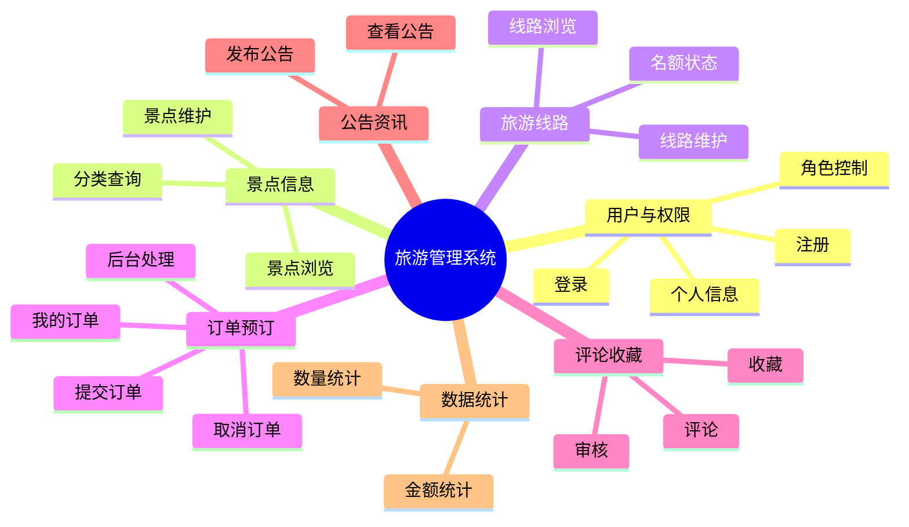
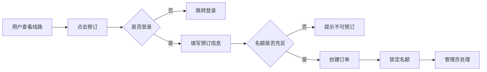
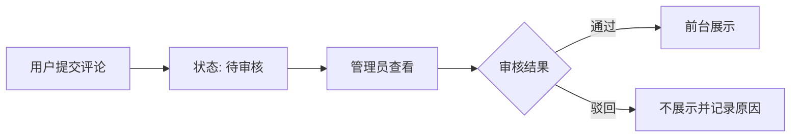

# 02-系统功能模块规划

## 1. 模块总览

## 2. 模块优先级

| 优先级 | 模块 | 说明 |
|---|---|---|
| P0 | 用户与权限 | 所有业务的基础。 |
| P0 | 景点信息 | 旅游系统基础数据。 |
| P0 | 旅游线路 | 订单预订依赖线路。 |
| P0 | 订单预订 | 核心业务闭环。 |
| P1 | 数据统计 | 管理员验收展示重点。 |
| P1 | 公告资讯 | 提升系统完整度。 |
| P1 | 评论收藏 | 用户互动功能。 |
| P2 | 图片上传、图表展示 | 时间充足时再做。 |

## 3. 用户端功能

| 页面/功能 | 输入 | 输出 | 依赖 |
|---|---|---|---|
| 注册 | 用户名、密码、手机/邮箱 | 注册成功或失败提示 | 用户表 |
| 登录 | 用户名、密码 | token、用户信息 | 用户表、权限模块 |
| 景点浏览 | 关键词、分类 | 景点列表 | 景点表 |
| 景点详情 | 景点 ID | 景点详情、评论 | 景点表、评论表 |
| 线路浏览 | 关键词、日期 | 线路列表 | 线路表 |
| 线路详情 | 线路 ID | 线路详情、预订入口 | 线路表 |
| 提交订单 | 线路 ID、人数、联系人 | 订单编号 | 订单表、线路名额 |
| 我的订单 | 登录用户 | 订单列表 | 订单表 |
| 收藏 | 目标类型、目标 ID | 收藏结果 | 收藏表 |
| 评论 | 目标类型、评分、内容 | 待审核评论 | 评论表 |

## 4. 管理员端功能

| 页面/功能 | 操作 | 说明 |
|---|---|---|
| 后台首页 | 查看统计卡片 | 展示总数量和订单金额。 |
| 景点管理 | 新增、编辑、删除、上下架 | 管理基础景点数据。 |
| 线路管理 | 新增、编辑、关闭、开放 | 管理线路和名额。 |
| 订单管理 | 查询、确认、驳回、完成 | 处理用户预订。 |
| 评论审核 | 通过、驳回 | 控制前台评论展示。 |
| 公告管理 | 新增、编辑、发布、下架 | 管理旅游公告。 |
| 用户管理 | 查询、禁用、启用 | 初版可简化。 |

## 5. 核心业务链路

### 5.1 线路预订链路

### 5.2 评论审核链路

## 6. 模块依赖关系

| 模块 | 依赖模块 | 说明 |
|---|---|---|
| 订单预订 | 用户、线路 | 用户登录后才能预订开放线路。 |
| 评论 | 用户、景点/线路 | 评论必须绑定目标对象。 |
| 收藏 | 用户、景点/线路 | 收藏必须绑定目标对象。 |
| 统计 | 景点、线路、订单 | 根据业务表汇总。 |
| 后台管理 | 权限 | 只有管理员可访问。 |

## 7. 可裁剪策略

如果开发时间不足，按以下顺序裁剪：

1. 图表统计改为简单数字卡片；
2. 用户管理后台只保留查看，不做禁用启用；
3. 图片上传改为图片 URL；
4. 评论审核保留核心通过/驳回，不做敏感词；
5. 收藏只支持列表和取消，不做分类筛选。

订单预订、景点管理、线路管理和管理员处理订单不得裁剪。
