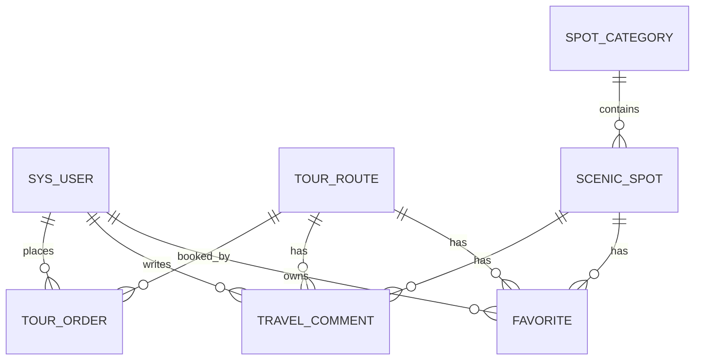

# 03-数据库设计说明

## 1. 设计目标

数据库用于保存旅游管理系统的核心业务数据，包括用户、景点分类、景点、线路、订单、评论、收藏和公告。设计原则是结构清晰、字段够用、约束明确，避免为了课程设计引入过多复杂关系。

## 2. 数据库基本设置

```sql
CREATE DATABASE IF NOT EXISTS tourism_management
  DEFAULT CHARACTER SET utf8mb4
  DEFAULT COLLATE utf8mb4_unicode_ci;
```

## 3. 表清单

| 表名 | 中文名 | 说明 |
|---|---|---|
| `sys_user` | 用户表 | 保存普通用户和管理员。 |
| `spot_category` | 景点分类表 | 保存景点分类信息。 |
| `scenic_spot` | 景点表 | 保存景点信息。 |
| `tour_route` | 线路表 | 保存旅游线路信息。 |
| `tour_order` | 订单表 | 保存用户预订记录。 |
| `travel_comment` | 评论表 | 保存评论和审核结果。 |
| `favorite` | 收藏表 | 保存用户收藏关系。 |
| `announcement` | 公告表 | 保存旅游公告。 |

## 4. E-R 关系



## 5. 建表示例

### 5.1 用户表

```sql
CREATE TABLE sys_user (
  id BIGINT PRIMARY KEY AUTO_INCREMENT,
  username VARCHAR(50) NOT NULL,
  password_hash VARCHAR(100) NOT NULL,
  nickname VARCHAR(50),
  phone VARCHAR(20),
  email VARCHAR(100),
  avatar_url VARCHAR(255),
  role VARCHAR(20) NOT NULL DEFAULT 'USER',
  status VARCHAR(20) NOT NULL DEFAULT 'ENABLED',
  created_at DATETIME NOT NULL DEFAULT CURRENT_TIMESTAMP,
  updated_at DATETIME NOT NULL DEFAULT CURRENT_TIMESTAMP ON UPDATE CURRENT_TIMESTAMP,
  UNIQUE KEY uk_sys_user_username (username)
) ENGINE=InnoDB DEFAULT CHARSET=utf8mb4;
```

### 5.2 景点分类表

```sql
CREATE TABLE spot_category (
  id BIGINT PRIMARY KEY AUTO_INCREMENT,
  name VARCHAR(50) NOT NULL,
  sort_order INT NOT NULL DEFAULT 0,
  status VARCHAR(20) NOT NULL DEFAULT 'ON',
  created_at DATETIME NOT NULL DEFAULT CURRENT_TIMESTAMP,
  updated_at DATETIME NOT NULL DEFAULT CURRENT_TIMESTAMP ON UPDATE CURRENT_TIMESTAMP,
  UNIQUE KEY uk_spot_category_name (name)
) ENGINE=InnoDB DEFAULT CHARSET=utf8mb4;
```

### 5.3 景点表

```sql
CREATE TABLE scenic_spot (
  id BIGINT PRIMARY KEY AUTO_INCREMENT,
  name VARCHAR(100) NOT NULL,
  category_id BIGINT,
  address VARCHAR(255),
  ticket_price DECIMAL(10,2) NOT NULL DEFAULT 0.00,
  open_time VARCHAR(100),
  introduction TEXT,
  image_url VARCHAR(255),
  status VARCHAR(20) NOT NULL DEFAULT 'ON',
  created_at DATETIME NOT NULL DEFAULT CURRENT_TIMESTAMP,
  updated_at DATETIME NOT NULL DEFAULT CURRENT_TIMESTAMP ON UPDATE CURRENT_TIMESTAMP,
  KEY idx_scenic_spot_name (name),
  KEY idx_scenic_spot_category (category_id),
  CONSTRAINT fk_spot_category FOREIGN KEY (category_id) REFERENCES spot_category(id)
) ENGINE=InnoDB DEFAULT CHARSET=utf8mb4;
```

### 5.4 线路表

```sql
CREATE TABLE tour_route (
  id BIGINT PRIMARY KEY AUTO_INCREMENT,
  name VARCHAR(100) NOT NULL,
  itinerary TEXT NOT NULL,
  price DECIMAL(10,2) NOT NULL DEFAULT 0.00,
  departure_time DATETIME NOT NULL,
  quota INT NOT NULL,
  booked_count INT NOT NULL DEFAULT 0,
  status VARCHAR(20) NOT NULL DEFAULT 'DRAFT',
  cover_image_url VARCHAR(255),
  created_at DATETIME NOT NULL DEFAULT CURRENT_TIMESTAMP,
  updated_at DATETIME NOT NULL DEFAULT CURRENT_TIMESTAMP ON UPDATE CURRENT_TIMESTAMP,
  KEY idx_tour_route_name (name),
  KEY idx_tour_route_status (status)
) ENGINE=InnoDB DEFAULT CHARSET=utf8mb4;
```

### 5.5 订单表

```sql
CREATE TABLE tour_order (
  id BIGINT PRIMARY KEY AUTO_INCREMENT,
  order_no VARCHAR(32) NOT NULL,
  user_id BIGINT NOT NULL,
  route_id BIGINT NOT NULL,
  people_count INT NOT NULL,
  contact_name VARCHAR(50) NOT NULL,
  contact_phone VARCHAR(20) NOT NULL,
  total_amount DECIMAL(10,2) NOT NULL,
  status VARCHAR(20) NOT NULL DEFAULT 'PENDING',
  remark VARCHAR(255),
  created_at DATETIME NOT NULL DEFAULT CURRENT_TIMESTAMP,
  updated_at DATETIME NOT NULL DEFAULT CURRENT_TIMESTAMP ON UPDATE CURRENT_TIMESTAMP,
  UNIQUE KEY uk_tour_order_no (order_no),
  KEY idx_tour_order_user (user_id),
  KEY idx_tour_order_route (route_id),
  KEY idx_tour_order_status (status),
  CONSTRAINT fk_order_user FOREIGN KEY (user_id) REFERENCES sys_user(id),
  CONSTRAINT fk_order_route FOREIGN KEY (route_id) REFERENCES tour_route(id)
) ENGINE=InnoDB DEFAULT CHARSET=utf8mb4;
```

### 5.6 评论表

> 注：表名使用 `travel_comment` 避免与 SQL 关键字 `comment` 冲突。

```sql
CREATE TABLE travel_comment (
  id BIGINT PRIMARY KEY AUTO_INCREMENT,
  user_id BIGINT NOT NULL,
  target_type VARCHAR(20) NOT NULL,
  target_id BIGINT NOT NULL,
  rating INT NOT NULL DEFAULT 5,
  content VARCHAR(500) NOT NULL,
  status VARCHAR(20) NOT NULL DEFAULT 'PENDING',
  audit_remark VARCHAR(255),
  created_at DATETIME NOT NULL DEFAULT CURRENT_TIMESTAMP,
  updated_at DATETIME NOT NULL DEFAULT CURRENT_TIMESTAMP ON UPDATE CURRENT_TIMESTAMP,
  KEY idx_comment_user (user_id),
  KEY idx_comment_target (target_type, target_id),
  KEY idx_comment_status (status),
  CONSTRAINT fk_comment_user FOREIGN KEY (user_id) REFERENCES sys_user(id)
) ENGINE=InnoDB DEFAULT CHARSET=utf8mb4;
```

### 5.7 收藏表

```sql
CREATE TABLE favorite (
  id BIGINT PRIMARY KEY AUTO_INCREMENT,
  user_id BIGINT NOT NULL,
  target_type VARCHAR(20) NOT NULL,
  target_id BIGINT NOT NULL,
  created_at DATETIME NOT NULL DEFAULT CURRENT_TIMESTAMP,
  UNIQUE KEY uk_favorite_user_target (user_id, target_type, target_id),
  KEY idx_favorite_user (user_id),
  CONSTRAINT fk_favorite_user FOREIGN KEY (user_id) REFERENCES sys_user(id)
) ENGINE=InnoDB DEFAULT CHARSET=utf8mb4;
```

### 5.8 公告表

```sql
CREATE TABLE announcement (
  id BIGINT PRIMARY KEY AUTO_INCREMENT,
  title VARCHAR(100) NOT NULL,
  content TEXT NOT NULL,
  status VARCHAR(20) NOT NULL DEFAULT 'DRAFT',
  publish_time DATETIME,
  created_at DATETIME NOT NULL DEFAULT CURRENT_TIMESTAMP,
  updated_at DATETIME NOT NULL DEFAULT CURRENT_TIMESTAMP ON UPDATE CURRENT_TIMESTAMP,
  KEY idx_announcement_status (status)
) ENGINE=InnoDB DEFAULT CHARSET=utf8mb4;
```

## 6. 状态字段约定

| 字段 | 可选值 | 说明 |
|---|---|---|
| `sys_user.role` | USER、ADMIN | 用户角色。 |
| `sys_user.status` | ENABLED、DISABLED | 用户状态。 |
| `spot_category.status` | ON、OFF | 分类是否启用。 |
| `scenic_spot.status` | ON、OFF | 景点上下架。 |
| `tour_route.status` | DRAFT、OPEN、FULL、CLOSED | 线路状态。 |
| `tour_order.status` | PENDING、CONFIRMED、CANCELLED、REJECTED、COMPLETED | 订单状态。 |
| `travel_comment.status` | PENDING、APPROVED、REJECTED | 评论审核状态。 |
| `announcement.status` | DRAFT、PUBLISHED、OFFLINE | 公告状态。 |

## 7. 初始化数据建议

最少准备以下演示数据：

| 数据 | 数量建议 | 说明 |
|---|---:|---|
| 管理员账号 | 1 | `admin/admin123`。 |
| 普通用户账号 | 2 | 用于用户端演示。 |
| 景点分类 | 3-5 | 如自然风光、人文古迹、主题乐园、休闲度假。 |
| 景点 | 8-12 | 覆盖多个分类。 |
| 线路 | 5-8 | 覆盖开放、已满、关闭等状态。 |
| 公告 | 3 | 至少 1 条已发布。 |
| 订单 | 5-10 | 覆盖待处理、已确认、已取消等状态。 |

## 8. 数据一致性规则

1. 创建订单时增加线路 `booked_count`；
2. 取消、驳回订单时减少线路 `booked_count`；
3. `booked_count` 不能小于 0，不能大于 `quota`；
4. `booked_count >= quota` 时线路状态可设为 `FULL`；
5. 评论只有 `APPROVED` 状态才能在前台展示；
6. 收藏表通过唯一索引防止重复收藏。
