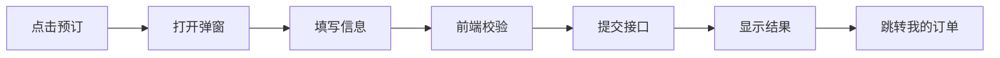

# 05-前端页面与交互说明

## 1. 前端目标

前端负责向用户展示旅游信息，并提供普通用户和管理员的操作界面。页面设计应简洁、易演示、易验收，优先完成核心业务流程。

## 2. 前端技术

| 技术 | 用途 |
|---|---|
| Vue 3 | 页面组件开发。 |
| Vite | 开发和构建。 |
| Vue Router | 路由管理。 |
| Pinia | 登录状态和用户信息。 |
| Axios | 调用后端接口。 |
| Element Plus | 表格、表单、弹窗、分页。 |

## 2.1 设计规范

前端视觉风格参考 `design-md/` 目录下的设计规范文档：

- `design-md/主风格/DESIGN.md` — 用户端整体风格（Airbnb 风格，白色画布 + #ff385c 强调色 + 圆角柔和）；
- `design-md/后台管理/DESIGN.md` — 后台管理端风格（Airtable 风格，白色画布 + #181d26 深色主调 + 签名色卡片）。

开发时按规范文档中的颜色、字体、间距、圆角和组件定义实现，通过 Element Plus CSS 变量覆盖默认样式。

### 第一阶段完成情况

- [x] 前端工程初始化（Vue 3 + Vite + Element Plus + Pinia + Vue Router + Axios）
- [x] 登录/注册页面
- [x] 路由守卫（ADMIN 权限控制）
- [x] 公开端首页（推荐景点、线路、公告）
- [x] 景点列表与详情
- [x] 线路列表与详情
- [x] 公告列表与详情
- [x] 管理员后台首页占位（统计卡片）
- [x] 设计规范应用（主风格 Airbnb、后台 Airtable）

### 第二阶段完成情况

- [x] 线路预订弹窗（人数、联系人、电话、预计金额）
- [x] 我的订单列表与取消订单
- [x] 景点/线路收藏按钮
- [x] 我的收藏列表与取消收藏
- [x] 个人中心资料展示与刷新
- [x] 登录态路由守卫扩展（requiresAuth）

### 第三阶段完成情况

- [x] 后台景点管理页面
- [x] 后台景点查询、筛选、分页
- [x] 后台景点新增、修改、删除
- [x] 后台景点上架、下架
- [x] 后台分类管理弹窗
- [x] 分类新增、修改、删除
- [x] 后台线路管理页面
- [x] 后台线路查询、筛选、分页
- [x] 后台线路新增、修改、删除
- [x] 后台线路状态管理
- [x] 后台订单管理页面
- [x] 后台订单查询、筛选、分页
- [x] 后台订单详情查看
- [x] 后台订单确认、驳回、完成、取消

## 3. 路由规划

### 3.1 用户端路由

| 路由 | 页面 | 权限 | 说明 |
|---|---|---|---|
| `/` | 首页 | 公开 | 展示推荐景点、线路和公告。 |
| `/login` | 登录页 | 公开 | 用户和管理员共用登录入口。 |
| `/register` | 注册页 | 公开 | 普通用户注册。 |
| `/spots` | 景点列表 | 公开 | 查询和筛选景点。 |
| `/spots/:id` | 景点详情 | 公开 | 展示景点详情、评论、收藏。 |
| `/routes` | 线路列表 | 公开 | 查询和筛选线路。 |
| `/routes/:id` | 线路详情 | 公开 | 展示线路详情和预订入口。 |
| `/my/orders` | 我的订单 | USER | 查看和取消订单。 |
| `/my/favorites` | 我的收藏 | USER | 查看和取消收藏。 |
| `/profile` | 个人中心 | USER/ADMIN | 修改个人信息。 |

### 3.2 管理员路由

| 路由 | 页面 | 权限 | 说明 |
|---|---|---|---|
| `/admin/dashboard` | 后台首页 | ADMIN | 统计卡片。 |
| `/admin/spots` | 景点管理 | ADMIN | CRUD。 |
| `/admin/routes` | 线路管理 | ADMIN | CRUD 和状态管理。 |
| `/admin/orders` | 订单管理 | ADMIN | 查询和处理订单。 |
| `/admin/comments` | 评论审核 | ADMIN | 通过或驳回评论。 |
| `/admin/announcements` | 公告管理 | ADMIN | 发布和下架公告。 |

## 4. 页面布局

### 4.1 用户端布局

```text
顶部导航：系统名称 | 景点 | 线路 | 公告 | 我的订单 | 登录/用户名
主体区域：根据页面展示列表、详情或表单
底部：课程设计说明或版权信息
```

### 4.2 管理员端布局

```text
左侧菜单：后台首页、景点管理、线路管理、订单管理、评论审核、公告管理
顶部栏：当前管理员、退出登录
内容区：表格、筛选条件、操作按钮、弹窗表单
```

## 5. 关键页面设计

### 5.1 登录页

表单字段：

| 字段 | 校验 |
|---|---|
| 用户名 | 必填。 |
| 密码 | 必填，长度不少于 6 位。 |

交互：

1. 登录成功后保存 token 和用户信息；
2. 如果角色为 ADMIN，跳转 `/admin/dashboard`；
3. 如果角色为 USER，跳转首页或原目标页面；
4. 登录失败显示错误信息。

### 5.2 景点列表页

元素：

- 查询输入框；
- 分类下拉框；
- 景点卡片或表格；
- 分页；
- 查看详情按钮。

展示字段：名称、分类、地址、票价、开放时间、图片。

### 5.3 线路详情页

展示字段：

- 线路名称；
- 行程安排；
- 价格；
- 出发时间；
- 总名额和剩余名额；
- 状态；
- 预订按钮。

预订按钮规则：

| 条件 | 按钮状态 |
|---|---|
| 未登录 | 点击后跳转登录。 |
| 状态 OPEN 且有剩余名额 | 可点击。 |
| 状态 FULL 或 CLOSED | 禁用。 |

### 5.4 订单预订弹窗

字段：

| 字段 | 校验 |
|---|---|
| 预订人数 | 正整数，不能超过剩余名额。 |
| 联系人 | 必填。 |
| 联系电话 | 必填，简单手机号格式校验。 |
| 预计金额 | 自动计算，不可手动编辑。 |

流程：



### 5.5 后台表格页通用结构

后台景点、线路、订单、评论和公告页面均采用类似结构：

1. 查询区：关键词、状态、时间范围；
2. 操作区：新增、刷新、批量操作可选；
3. 表格区：显示主要字段；
4. 操作列：查看、编辑、删除、审核、处理等；
5. 分页区：页码和每页条数。

## 6. 前端状态管理

### 6.1 用户 Store

保存内容：

```ts
interface UserState {
  token: string | null
  id: number | null
  username: string | null
  role: 'USER' | 'ADMIN' | null
}
```

### 6.2 路由守卫

规则：

1. 访问需要登录的页面时，如果没有 token，跳转登录页；
2. 访问 `/admin` 开头页面时，必须为 ADMIN；
3. 普通用户访问后台页面时跳转首页并提示无权限。

## 7. 接口封装

建议按业务拆分 API 文件：

```text
src/api/authApi.ts
src/api/userApi.ts
src/api/spotApi.ts
src/api/routeApi.ts
src/api/orderApi.ts
src/api/commentApi.ts
src/api/favoriteApi.ts
src/api/announcementApi.ts
src/api/statisticsApi.ts
```

Axios 拦截器：

1. 请求前自动加 token；
2. 响应后统一处理错误码；
3. 401 时清除登录状态并跳转登录页。

## 8. 页面验收标准

1. 用户端页面能完整走通“浏览线路 -> 登录 -> 预订 -> 我的订单”流程；
2. 管理员端能完成景点和线路维护；
3. 管理员能处理订单和审核评论；
4. 普通用户看不到后台菜单；
5. 页面刷新后登录状态可保持；
6. 表单错误提示清晰。
