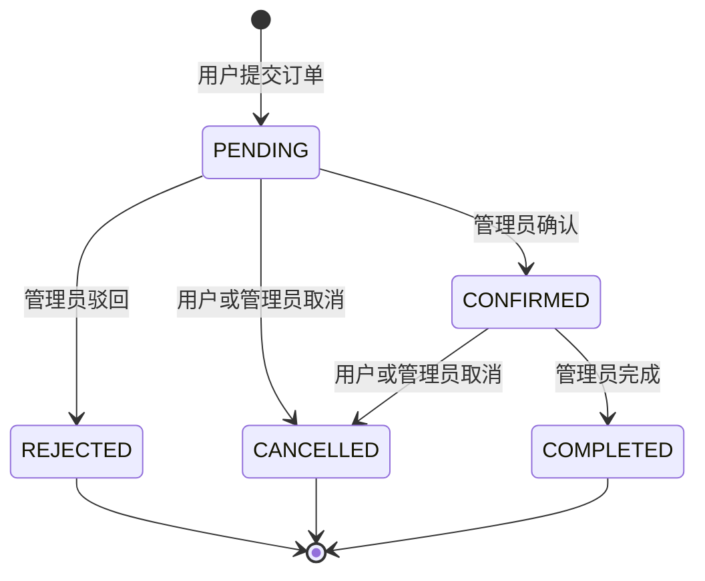

# 06-权限与业务规则说明

## 1. 角色定义

| 角色 | 代码 | 说明 |
|---|---|---|
| 游客 | GUEST | 未登录访问者，系统中不保存角色。 |
| 普通用户 | USER | 注册用户，可预订、收藏、评论。 |
| 管理员 | ADMIN | 后台管理用户。 |

## 2. 权限矩阵

| 功能 | 游客 | 普通用户 | 管理员 |
|---|---:|---:|---:|
| 查看首页 | 是 | 是 | 是 |
| 查看景点列表和详情 | 是 | 是 | 是 |
| 查看线路列表和详情 | 是 | 是 | 是 |
| 查看公告 | 是 | 是 | 是 |
| 用户注册 | 是 | 否 | 否 |
| 登录退出 | 是 | 是 | 是 |
| 修改个人信息 | 否 | 是 | 是 |
| 预订线路 | 否 | 是 | 否 |
| 查看自己的订单 | 否 | 是 | 否 |
| 取消自己的订单 | 否 | 是 | 否 |
| 收藏景点或线路 | 否 | 是 | 否 |
| 发表评论 | 否 | 是 | 否 |
| 景点管理 | 否 | 否 | 是 |
| 线路管理 | 否 | 否 | 是 |
| 订单处理 | 否 | 否 | 是 |
| 评论审核 | 否 | 否 | 是 |
| 公告管理 | 否 | 否 | 是 |
| 数据统计 | 否 | 否 | 是 |

## 3. 用户规则

1. 用户名唯一；
2. 注册用户默认角色为 USER；
3. 管理员账号由初始化脚本创建，不开放前台注册管理员；
4. 禁用用户不能登录；
5. 用户只能修改自己的昵称、手机号、邮箱、头像等资料。

## 4. 景点规则

1. 景点名称不能为空；
2. 景点票价不能小于 0；
3. 景点状态为 ON 时可在前台展示；
4. 景点状态为 OFF 时仅管理员可见；
5. 已产生评论或收藏的景点建议下架，不建议直接物理删除。

## 5. 线路规则

### 5.1 线路状态

| 状态 | 说明 | 公开端可见 | 用户是否可预订 |
|---|---|---:|---:|
| DRAFT | 草稿，管理员编辑中 | 否 | 否 |
| OPEN | 开放预订 | 是 | 是 |
| FULL | 名额已满 | 是 | 否 |
| CLOSED | 已关闭 | 否 | 否 |

公开端只展示 OPEN 和 FULL 状态的线路。DRAFT 和 CLOSED 状态的线路仅管理员可见。

### 5.2 线路名额规则

1. `quota` 必须大于 0；
2. `booked_count` 初始值为 0；
3. `booked_count` 不能大于 `quota`；
4. 创建订单成功后锁定名额；
5. 取消或驳回订单后释放名额；
6. 当剩余名额为 0 时，线路状态可自动变为 FULL；
7. 当释放名额后，如果线路未关闭，可恢复为 OPEN。

### 5.3 线路删除规则

1. 如果线路上已有关联订单，禁止物理删除，返回 409；
2. 管理员可将线路状态改为 CLOSED 以替代删除。

## 6. 订单规则

### 6.1 订单状态流转



### 6.2 创建订单规则

1. 用户必须登录；
2. 线路必须存在；
3. 线路状态必须为 OPEN；
4. 预订人数必须为正整数；
5. 剩余名额必须大于等于预订人数；
6. 订单金额由系统计算，不接受前端传入金额作为最终金额；
7. 创建成功后状态为 PENDING。

### 6.3 取消订单规则

| 当前状态 | 用户可取消 | 管理员可取消 | 是否释放名额 |
|---|---:|---:|---:|
| PENDING | 是 | 是 | 是 |
| CONFIRMED | 是 | 是 | 是 |
| CANCELLED | 否 | 否 | 否 |
| REJECTED | 否 | 否 | 已释放 |
| COMPLETED | 否 | 否 | 否 |

### 6.4 订单金额规则

```text
订单金额 = 线路价格 × 预订人数
```

后端必须重新计算订单金额，不能直接信任前端传来的金额。

## 7. 评论规则

1. 用户登录后才能发表评论；
2. 评论目标类型只能是 SPOT 或 ROUTE；
3. 评论内容不能为空，长度建议不超过 500 字；
4. 评分范围为 1 到 5；
5. 评论创建后状态为 PENDING；
6. 只有 APPROVED 评论在前台展示；
7. 管理员可以通过或驳回评论。

## 8. 收藏规则

1. 用户登录后才能收藏；
2. 收藏目标类型只能是 SPOT 或 ROUTE；
3. 同一用户不能重复收藏同一目标；
4. 用户只能取消自己的收藏。

## 9. 公告规则

1. 管理员可以创建公告草稿；
2. 公告发布后状态为 PUBLISHED，并记录发布时间；
3. 用户端只展示 PUBLISHED 公告；
4. 下架公告状态为 OFFLINE。

## 10. 统计规则

| 指标 | 统计口径 |
|---|---|
| 景点数量 | `scenic_spot` 总数，或可按 ON 状态统计。 |
| 线路数量 | `tour_route` 总数，或可按 OPEN 状态统计。 |
| 订单数量 | `tour_order` 总数。 |
| 订单金额 | 统计 CONFIRMED 和 COMPLETED 状态订单金额。 |
| 待处理订单 | 统计 PENDING 状态订单。 |

## 11. 后端权限实现要求

1. `/api/admin/**` 必须要求 ADMIN；
2. `/api/orders/**`、`/api/favorites/**`、`/api/comments` 的写操作必须要求 USER；
3. 获取订单详情时必须校验订单所属用户；
4. 管理员处理订单时必须记录处理备注或更新时间；
5. 前端权限控制只作为体验优化，不能替代后端校验。
